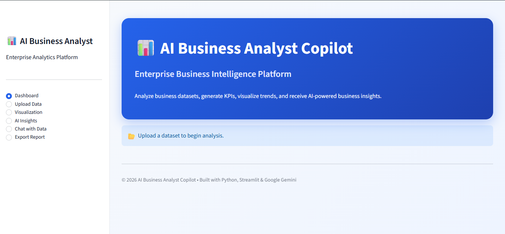
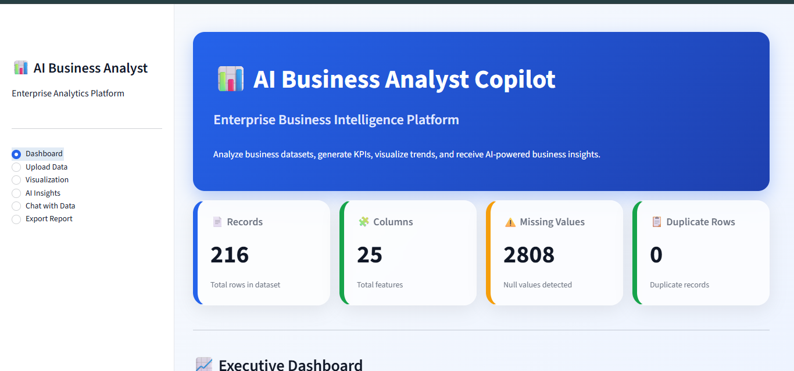
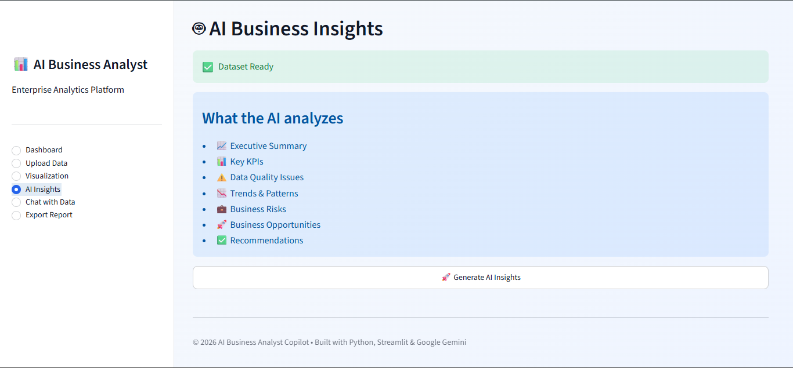
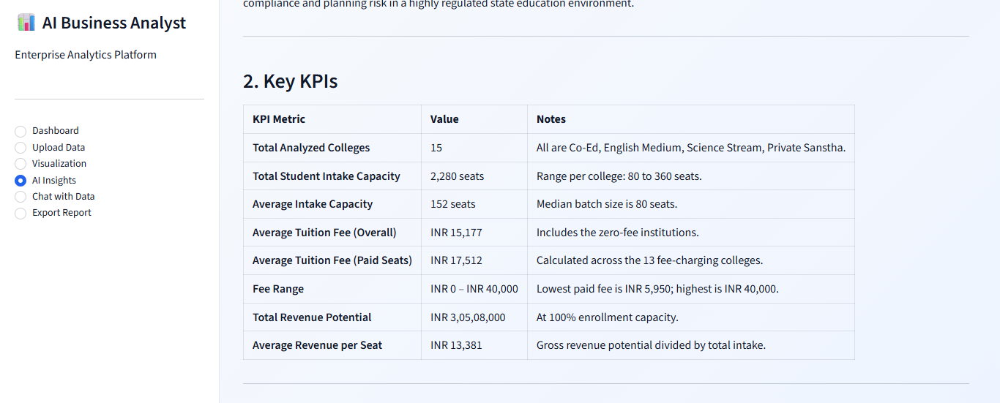

# 🤖 AI Business Analyst Copilot

> **An AI-powered Business Intelligence platform that transforms raw business datasets into interactive dashboards, KPI reports, and AI-generated business insights using Google Gemini.**

<p align="center">


</p>

---

# 📸 Application Preview

> Replace these images with your screenshots.

## 🏠 Home Page



---

## 📊 Interactive Dashboard


---

## 🤖 AI Business Insights



---

## 📈 KPI Analysis



---

# 📌 Overview

AI Business Analyst Copilot is an intelligent business analytics platform that automates data analysis using **Python, Streamlit, and Google's Gemini AI**.

The application enables business users, analysts, and decision-makers to upload datasets and instantly generate:

- Interactive Dashboards
- KPI Reports
- Data Visualizations
- Executive Summaries
- AI-powered Business Insights
- Actionable Recommendations

The goal is to reduce manual reporting effort while enabling faster, data-driven business decisions.

---

# 💡 Why This Project?

Business analysts spend a significant amount of time:

- Cleaning data
- Building dashboards
- Creating reports
- Finding trends
- Writing executive summaries

This project automates these repetitive tasks by combining **Business Intelligence** with **Generative AI**, enabling users to focus on decision-making instead of manual analysis.

---

# 🚀 Features

✅ Upload CSV & Excel datasets

✅ Automatic Data Cleaning

✅ Exploratory Data Analysis (EDA)

✅ KPI Dashboard

✅ Interactive Charts

✅ Missing Value Detection

✅ Correlation Analysis

✅ AI Executive Summary

✅ AI Business Insights

✅ Business Recommendations

✅ Downloadable Reports

✅ Responsive Streamlit Interface

---

# 🔄 Workflow

```
              Upload Dataset
                     │
                     ▼
           Automatic Data Cleaning
                     │
                     ▼
      Exploratory Data Analysis (EDA)
                     │
                     ▼
          Interactive KPI Dashboard
                     │
                     ▼
       Google Gemini AI Analysis
                     │
                     ▼
      Business Insights & Recommendations
                     │
                     ▼
          Executive Summary Report
```

---

# 🎯 Business Value

This application helps organizations by:

- Automating repetitive reporting tasks
- Identifying key business trends
- Detecting performance issues
- Improving decision-making
- Generating executive-ready summaries
- Reducing manual analysis effort
- Delivering AI-powered recommendations

---

# 📊 Key Functionalities

| Module | Description |
|----------|-------------|
| Data Upload | Upload CSV & Excel datasets |
| Data Cleaning | Automatic preprocessing |
| EDA | Exploratory Data Analysis |
| Dashboard | Interactive KPI Monitoring |
| Charts | Dynamic Business Visualizations |
| AI Insights | Google Gemini Generated Insights |
| Recommendations | AI-based Business Suggestions |
| Reports | Executive Summary Generation |

---

# 🤖 Sample AI Output

```
Executive Summary

• Sales increased by 18% during Q2.

• West Region generated the highest revenue.

• Electronics category recorded the fastest growth.

• Customer retention decreased by 6%.

Business Recommendation

Increase inventory allocation in the West Region.

Improve customer retention through loyalty campaigns.

Focus marketing investment on Electronics products.
```

---

# 🛠 Tech Stack

| Category | Technologies |
|----------|--------------|
| Programming | Python |
| Data Analytics | Pandas, NumPy |
| Visualization | Plotly, Matplotlib |
| Web Framework | Streamlit |
| Artificial Intelligence | Google Gemini API |
| Data Processing | OpenPyXL |
| Version Control | Git, GitHub |

---

# 📂 Project Structure

```
AI-Business-Analyst-Copilot/

│── app.py
│── requirements.txt
│── README.md
│── .gitignore
│
├── assets/
├── pages/
├── utils/
├── data/
└── screenshots/
```

---

# ⚙ Installation

## Clone Repository

```bash
git clone https://github.com/Harshh030703/AI-Business-Analyst-Copilot.git
```

---

## Navigate to Project

```bash
cd AI-Business-Analyst-Copilot
```

---

## Install Dependencies

```bash
pip install -r requirements.txt
```

---

## Create Environment Variable

Create a `.env` file

```env
GEMINI_API_KEY=YOUR_API_KEY
```

---

## Run Application

```bash
streamlit run app.py
```

---

# 🚀 Future Roadmap

- Conversational Chat with Dataset
- Predictive Analytics
- Forecasting Models
- PDF Report Generation
- Excel Report Export
- Power BI Style Dashboards
- User Authentication
- Multi-file Analysis
- Cloud Deployment
- RAG-based Document Analysis

---

# 📈 Skills Demonstrated

- Business Intelligence
- Business Analysis
- Data Analytics
- Exploratory Data Analysis
- Dashboard Development
- Data Cleaning
- Python Programming
- SQL Concepts
- Generative AI
- Prompt Engineering
- Google Gemini API
- Streamlit Development
- KPI Reporting
- Data Visualization
- Decision Support Systems

---

# 👨‍💻 Author

## Harsh Dashpute

**Data Analyst | Business Analyst | Generative AI Enthusiast**

📧 harshhsdashpute@gmail.com

💼 LinkedIn:
https://linkedin.com/in/harshdashpute03

⭐ If you found this project interesting, consider giving it a star!